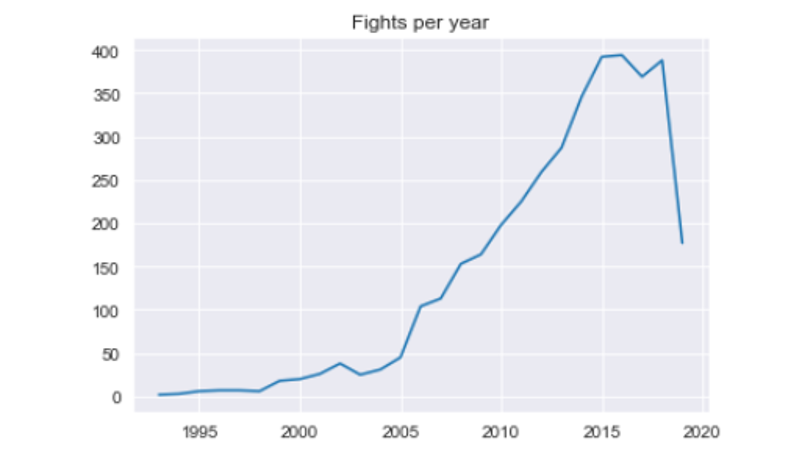
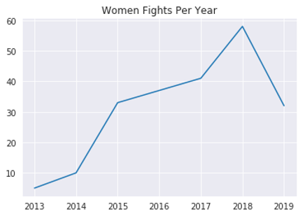
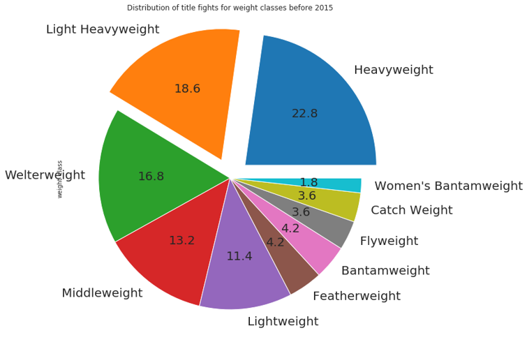
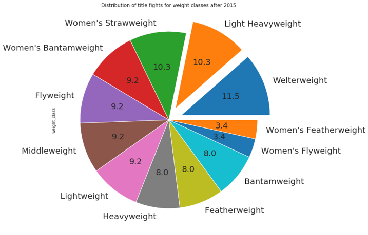
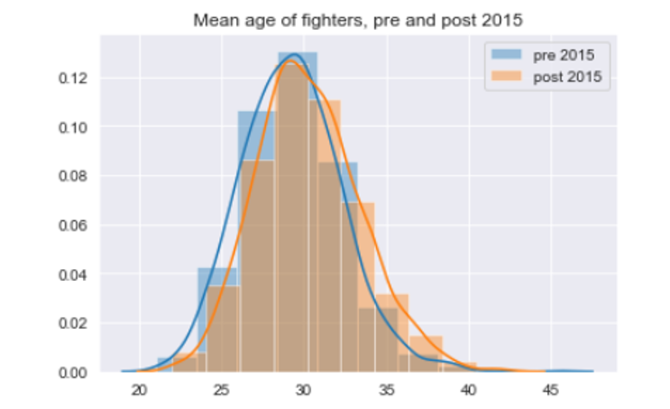
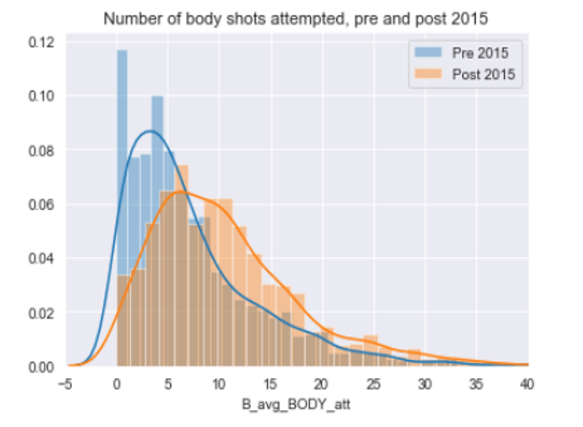
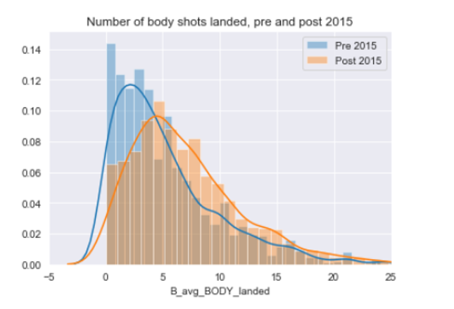
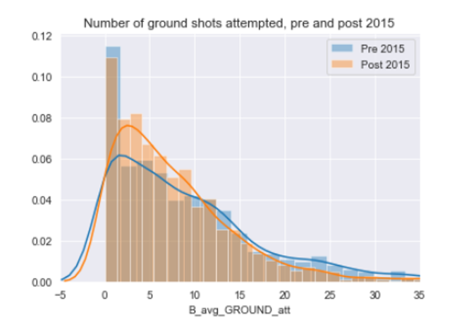
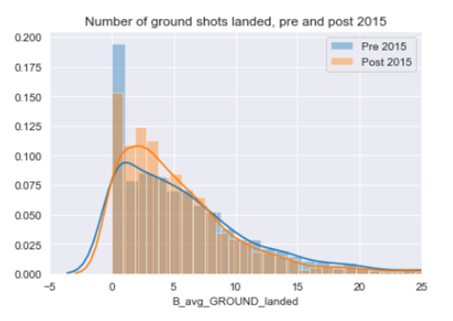

In this project, we wanted to examine how the Ultimate Fighting Championship’s (UFC)
compliance with the United States Anti-Doping Agency (USADA) affected both the details of the
fighters, and how fights were occurring. The UFC implemented USADA in 2015, the program
was designed not only to protect the health of competitors, but also preserve integrity of the
competition. The main theme our findings is that the way fighters are fighting has changed as
USADA was implemented, especially when it comes to the technique’s fighters were using, and
the weight divisions of title fights.

Our first interesting finding is that the after 2015, the number of fights per year does not
significantly change in any way:




While there is a small drop into the 2016 year, the number is not significant, and it seems to
return to normal in 2017. Note: There is a large drop off going into the 2019 year because at
the time this dataset was compiled, not all 2019 fights had occurred.

What is more interesting is that the number of
female fights increased significantly after 2015:



```
Another very interesting data point is that the distribution of title fights changed significantly:



And the distribution post 2015:



As you can see, the distribution of the weight classes for title fights has changed dramatically,
heavyweight fights are post-2015 are half of what they were pre-2015. This metric also reflects our
other finding that the number of female fights had increased as well.


We found that while there only a small increase in the median age of fights, this is an
interesting case as you may expect there to be younger fighters, with a strong anti-doping policy in
place.



After 2015, we found that the number of body strikes attempted, and body strikes that landed
increased:





What we can see here is that after 2015, fighters are adopting a technique and style of fighting
that involves much more body strikes than previously seen before 2015.


There is a similar finding when looking at the frequency of ground strikes that occur, that is
strikes that occur while either fighter is on the ground:





We can see that while the number of ground strikes that occur post, and pre- 2015 is similar, the
frequency at which they occur is higher post-2015. Fighters are getting into more ground engagements
post-2015.


